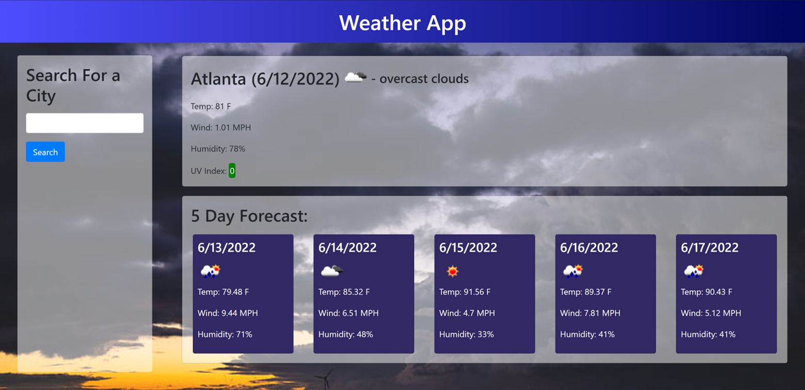
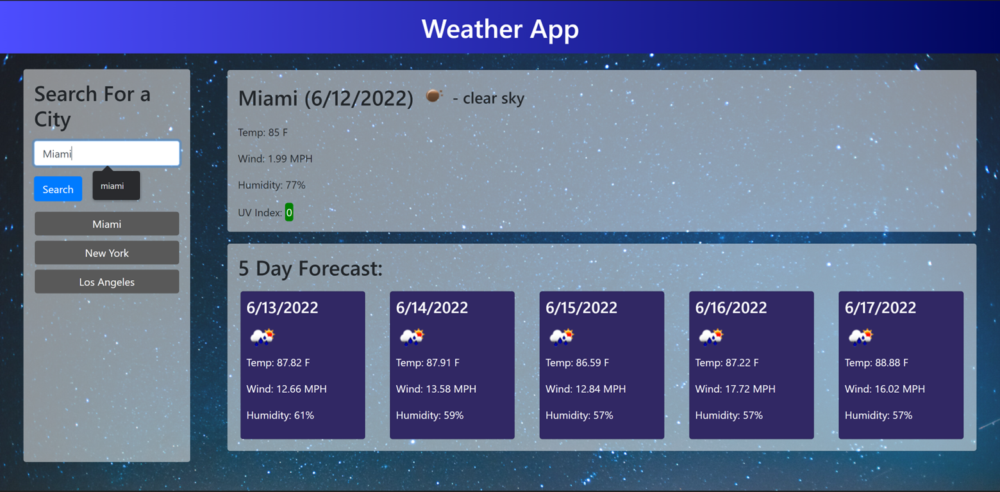
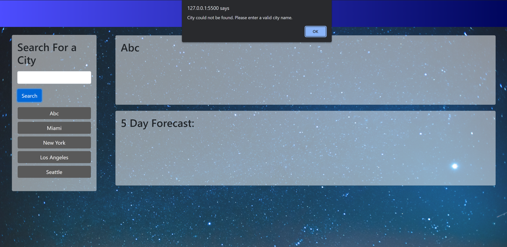

# weatherApp

## Display
When the website is first launched, the local storage is checked for an array of previously searched cities. If the local storage does not include this array, the weather for Atlanta, Georgia is displayed. If the array is found, the weather of the city most recently searched is displayed on the screen. This includes the current weather, a five day forecast, and a search bar where the user can enter the name of the city they would like to see the weather of next. Additionally, the background of the page is changed to reflect the current weather of the city being displayed. As the user searches various cities, the previous searches are saved into local storage and displayed as buttons beneath the city search bar. Only the five most recent searches are displayed.

## Searches
The user enters their searches into the form located on the left side of the screen. Once their search has been entered, the contents of the search bar is displayed as the city name on the display and the name of the city is used to make API calls to gather the weather data to be displayed on the screen. If the user enters an invalid city name, an alert is sent to inform the user that the city could not be found and intruct them to enter a valid city name.

## API Calls
Once the user has entered their search, an API call is made to search for the city's current weather. While the city's name can be used to get the city's current weather, a different API call, requiring the city's coordinates, must be made to gather the data for the five day forecast. The API call used to get the city's current weather also returns a variety of information including the city's longitude and latitude. These values are then saved into a variable which is then used to make the second API call to gather data on the city's five day forecast.

## Backgrounds
When the API call is made to collect data on the city's current weather, the city's main weather condition, sunrise time, and sunset time are also stored into variables. The current time is then checked against the sunrise and sunset times to determine whether it is daytime or nighttime in the city. Based on this day/night time check, the program then runs through one of two switch/case statements where the background of the page is set based on the city's main weather condition. If there is no image for the specific weather condition, the switch/case statement defaults to setting the background image as the clear sky either during the day or the night based off of the time of day.

## Screenshots

## Links
Deployment: https://oguerra9.github.io/weatherApp/
Repository: https://github.com/oguerra9/weatherApp